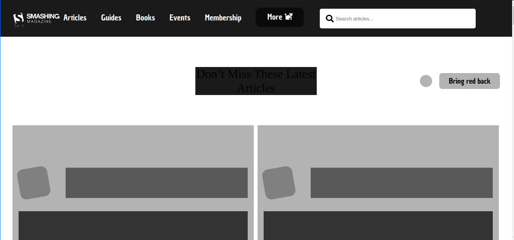

# smashing-magazine-heatmap

This project was created  for educational purpose for practicing the organization of elements regarding its importance in the page. We used the "heat map" format with this porpuse.
 we did that using an example of [smashing magazing](https://www.smashingmagazine.com/)  

## Built With

- HTML
- CSS

## Live Demo

[Live Demo Link](https://competent-ride-d3d6c8.netlify.app/)

## Getting Started

**To view this project, download the contents of the repository to your computer or clone the repository and open the index.html file using your preferred browser.**

## Authors

¤ **MUGIRASE Emmanuel**

- Github: [@descholar-ceo](https://github.com/descholar-ceo)
- Linkedin : [@MUGIRASE Emmanuel](https://www.linkedin.com/in/mugirase-emmanuel-a90b49143/)
- Twitter: [@descholar](https://twitter.com/@descholar3)

¤ **Aldana Abril Longhi**

- Github: [@AlduLonghi](https://github.com/AlduLonghi)
- Linkedin : [@Aldana Abril Longhi](https://www.linkedin.com/in/aldana-abril-longhi-a842ba1a7/)
- Twitter: [@AbrilLonghi](https://twitter.com/AbrilLonghi)

##  Contributing

Contributions, issues and feature requests are welcome!

## Show your support

Give a  if you like this project

## Acknowledgments

- [Microverse](https://microverse.org)

## Licences 
- This project is [MIT](https://github.com/microverseinc/readme-template/blob/master/lic.url) licensed.

